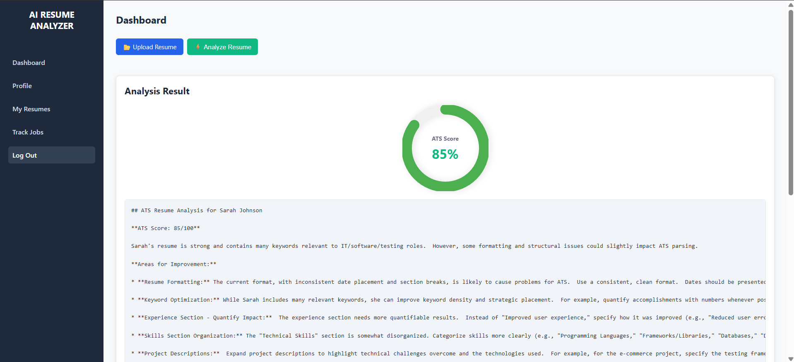

# 🤖 Talent Match AI – Resume Analyser

**Talent Match AI** is an intelligent, AI-powered tool that helps job seekers and recruiters by analyzing resumes with precision. It leverages AI + ATS (Applicant Tracking System) principles to evaluate resumes, identify gaps, and provide actionable improvements for better job alignment.  

---

## ✨ Features

- 📄 **Resume Parsing** – Extracts candidate details like skills, work experience, and education.  
- 🤖 **AI-Powered Analysis** – Uses Google Gemini AI to rate resumes against targeted roles.  
- 🔍 **Keyword Matching** – Ensures the resume meets job description requirements.  
- 📊 **ATS Scoring** – Provides a score out of 100 with visual feedback.  
- 💡 **Improvement Suggestions** – Bullet-point recommendations for better chances.  
- 🌐 **Multi-format Support** – Works with PDF and CSV files.  
- 🔐 **Authentication System** – Secure signup/login with hashed passwords.  

---

## 🛠️ Tech Stack

- **Backend:** Python (Flask)  
- **AI/ML:** Google Gemini AI, Regex, NLP  
- **Frontend:** HTML, CSS, JavaScript  
- **Database:** MySQL (Flask-MySQLdb, pymysql)  
- **Deployment-ready:** Docker / GitHub Actions  

---

## 🚀 How It Works

1. **User Authentication** – Sign up or log in securely.  
2. **Upload Resume** – Supported formats: PDF or CSV.  
3. **AI Analysis** – Google Gemini AI evaluates the resume.  
4. **ATS Score** – Get a visual donut-chart representation.  
5. **Suggestions** – Receive personalized insights for improvement.  
6. **Storage** – Resumes and results are stored in MySQL for users.  

---

## 📦 Installation & Setup

```bash
# Clone the repository
git clone https://github.com/your-username/ai-resume-analyser.git

# Navigate to the project directory
cd ai-resume-analyser

# Create virtual environment
python -m venv venv
source venv/bin/activate       # On Linux/Mac
venv\Scripts\activate          # On Windows

# Install dependencies
pip install -r requirements.txt

# Initialize Database
python init_db.py

# Run the application
python db_congif.py

```**


## 📸 Screenshots


